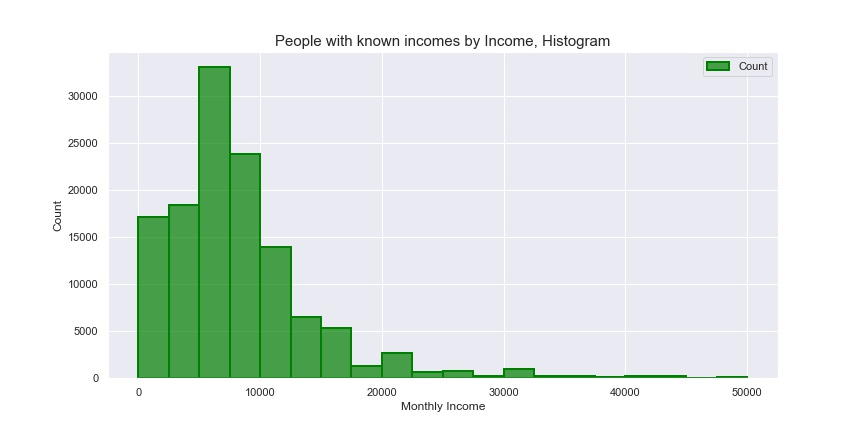
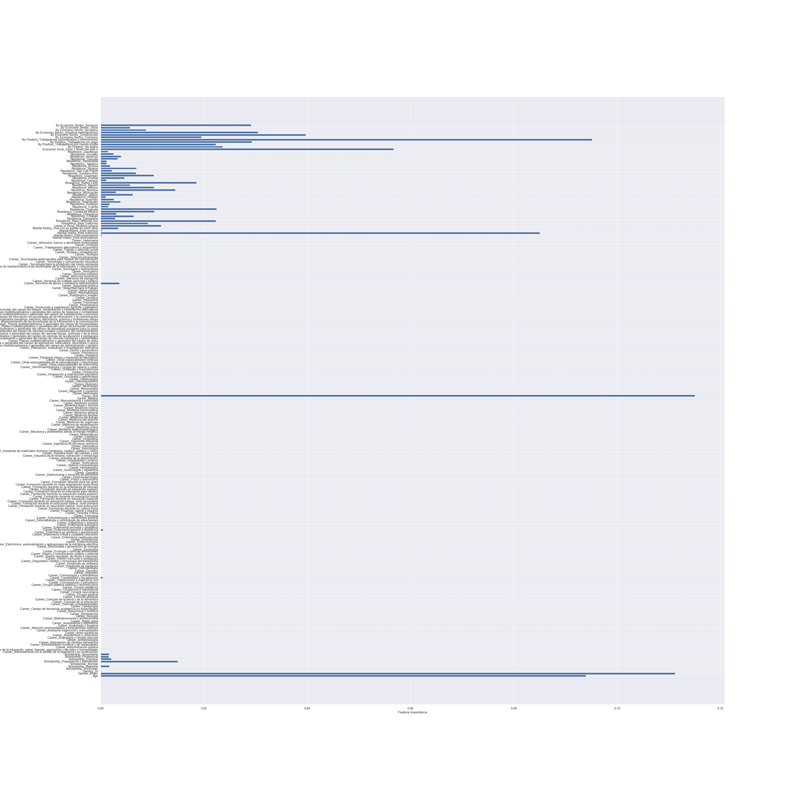
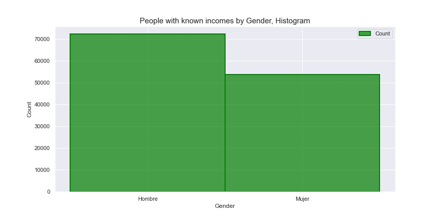
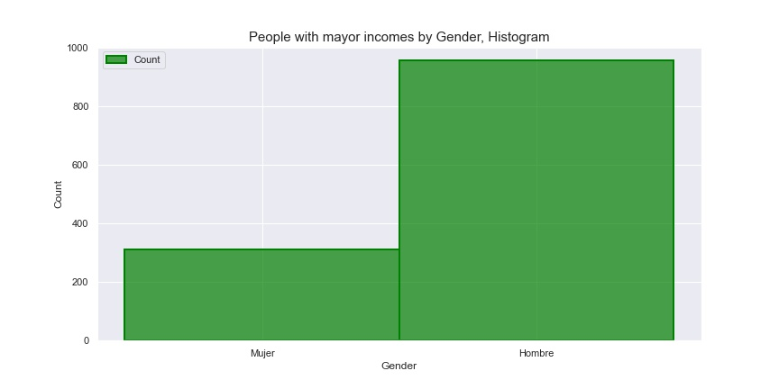

# Income Predictor for the Mexican Context
## Using Decision Classification Trees

This repository contains the code and documentation for the Capstone Project of Dámaris Flores Albores, completed in April 2023 as part of an apprenticeship program. The project involves evaluating business needs, data exploration, analysis, and modeling using regression and classification techniques.

## Project Files
The project files included in this repository are:
- `README.md`: This file, providing an overview of the project.
- `Income Predictor for the Mexican Context-The Notebook.ipynb`: A Jupyter Notebook file containing the final clean code.
- `Proposal/Capstone Project Proposal.pdf`: A PDF file containing the preliminary project proposal.
- `.gitignore`: A file containing the file's paths to be ignored by git
- `Notebooks/ENOE Income Predictor.ipynb`: A Jupyter Notebook file containing the code for the first Exploratory Data Analysis and first model.
- `Notebooks/Drafts-Models Regression and Classification.ipynb`: A Jupyter Notebook file containing the code for the Regression Tree, Linear Multiple Regression and Decission Classification Tree.
- `Notebooks/Gender 70 Accuracy.ipynb`: A Jupyter Notebook file containing the code for a Decission Classification Tree for prredicting Gender .
- `Notebooks/New Employed with 3 labels 67 accuracy.ipynb`: A Jupyter Notebook file containing the code for the Decission Tree with all incomes classified in 3 levels.
- `Notebooks/WK Incomes three labels 60 accuracy.ipynb`: A Jupyter Notebook file containing the code for the Decission Tree with just known incomes classified in 3 levels.
- `Notebooks/With Known Incomes w 10 labels 28 accuracy.ipynb`: A Jupyter Notebook file containing the code for the Decission Tree with just known incomes classified in 10 levels.
- `C4Capstone_IncomePredictor_DFA.pptx`: A Power Point presentation containing a business oriented summary of the project.
- `Data/`: A directory containing the dataset files used in the project.
- `Images/`: A directory containing the images used in the project.

## Dependencies
The following libraries are required to run the project notebooks:

- pandas: for data manipulation and analysis
- numpy: for numerical computing
- matplotlib and seaborn: for data visualization
- sqlite3: for working with SQLite database
- scipy: for statistical analysis
- statsmodels: for statistical modeling
- scikit-learn: for machine learning algorithms

## Steps

The project follows the following steps:

1. Business Understanding: Evaluate the business needs and determine key questions to guide the analysis.

2. Data Understanding: Perform an initial data exploration of the dataset to understand its contents and identify relevant features for analysis, considering available resources and timeline.

3. Data Preparation: Clean the dataset by addressing null data, renaming columns, and changing column types as needed for analysis.

4. Further Data Exploration: Decode the dataset and look for inconsistencies, as well as perform descriptive statistics to gain a deeper understanding of the data.

5. Regression Modeling: Implement a vanilla regression model as a starting point for analysis.

6. Classification Modeling: Explore classification modeling techniques by creating a new column with categories and implementing appropriate algorithms.

7. Model Tuning and Evaluation: Tune the models by trying different approaches and evaluate their performance against defined metrics.

8. Further Analysis: Explore additional approaches and provide suggestions for next steps in the analysis.

### Let's Get Started!! 

## Business Understanding

The purpose of this project is to develop a predictive model for income based on available data from the ENOE survey. The predicted income values can be used to fill in the missing data and improve the accuracy of social analytics and policy design in Mexico. The project also aims to analyze the factors that contribute to income determination and highlight the inequalities in income distribution.

## Data Understanding

This dataset contains 396,629 entries and 114 columns, fully encoded. The desicion was to choose a maximum of 15 features to work with.

The features were: 

1.- *Residence* - categorical   
2.- *Gender* - categorical  
3.- *Age* - numerical  
4.- *Literacy* - categorical  
5.- *Scholarship*  - categorical  
6.- *Career*  - categorical  
7.- *Marital Status*  - categorical  
8.- *Urban or Rural*  - categorical  
9.- *Income Zone*  - categorical  
10.- *Occupied Population by Position*  - categorical  
11.- *Occupied Population by Economic Sector*  - categorical  
12.- *Occupied Population by Income Level*  - categorical  
13.- *Monthly Income* - numerical       

## Data Preparation

Based on the data we remove spaces, convert them to numerical, strip the unspecified entries, drop employee, num of children, income level and years of study columns.

Finally we decoded the dataset by replacing the codes with the values. 
This is an example of the result:

| Residence | Gender | Age | Literacy | Scholarship | Career | Marital Status | Urban or Rural | Economic Zone | By Position | By Economic Sector | Monthly Income |
|-----------|--------|-----|----------|-------------|--------|----------------|----------------|---------------|-------------|-------------------|----------------|
| Ciudad de México | Hombre | 59 | Sí | Profesional | Biología | Está soltero(a) | Muestra urbana | Zona 2 Resto del país | Trabajadores subordinados y remunerados | Servicios | NaN |
| Ciudad de México | Hombre | 30 | Sí | Profesional | Planes multidisciplinarios o generales del campo | Está soltero(a) | Muestra urbana | Zona 2 Resto del país | Trabajadores subordinados y remunerados | Servicios | 16000.0 |
| Ciudad de México | Hombre | 42 | Sí | Profesional | Telecomunicaciones | Está separado(a) | Muestra urbana | Zona 2 Resto del país | Trabajadores subordinados y remunerados | Servicios | NaN |
| Ciudad de México | Mujer | 36 | Sí | Profesional | Gastronomía y servicios de alimentos | Está casado(a) | Muestra urbana | Zona 2 Resto del país | Trabajadores subordinados y remunerados | Servicios | NaN |
| Ciudad de México | Hombre | 43 | Sí | Profesional | Hospitalidad y turismo | Está casado(a) | Muestra urbana | Zona 2 Resto del país | Trabajadores subordinados y remunerados | Servicios | NaN |

## Modeling 

We try 3 different approaches for modeling. 
Before initiating any model we had to convert categorical values and normalize our data. Also, for the second and third approach it was necessary to create a new colmn with our target. 

### Regression Approach

The first one was a regression approach by implementing a regression tree model. 
However the model wasn't able to explain more than a 18% of our dataset. 
This could be because of the highly unbalance distribution of our data or because we are lacjing of importan information to feed our model.

### Classification Approach

The second was a decission classification tree, for this approach was necesary to create a new categorical column that would function as target. For starts we create 10 levels of income.
This approach only reached a 40.04% of accuracy. 

### Classification Approach with Label Re-Architecture

The third and final approach was a classification tree with only 3 labels. 

The baseline reach an accuracy of 58.65%. 

However, after tuning (changing criterion to Gini and defining min_splits, max_depths and min_sample_leafes) and bagging (optimization with a Bagging Classifier), it was possible to reach a 67.83% of accuracy with the following results: 

#### Train score : 0.6830281570407386

#### Test score: 0.678309271949083

| Class   | Precision | Recall | F1-Score | Support |
|---------|-----------|--------|----------|---------|
| Level 1 | 0.70      | 0.94   | 0.80     | 29867   |
| Level 2 | 0.49      | 0.05   | 0.09     | 6240    |
| Level 3 | 0.49      | 0.24   | 0.32     | 8986    |

Accuracy: 0.68
Macro Average F1-Score: 0.40
Weighted Average F1-Score: 0.61

Testing Accuracy for Bagging Tree Classifier: 67.83%

## Conclusion

Even though we were able to increase the accuracy of the model, due to the nature of our data, the current classes do not give us the desire results. The gap between Level 2 and 3 is too wide.  
However, it can help us to aproximate the income and hopefully to improve further social studies. 
This model should be use discretely, understanding its constraints and the characteristics of the data with which it was build.   

## Further Analysis

By reviewing the feature importance of our model we discovered that gender is a feature that seems to have a main importance, being the second most important feauture for our tree to determine Income Level. We could also observed the correlation between gender and monthly income and notice that when the income rises the gender inbalance is higher. 

We could keep exploring it and even create a logistic regression model to predict gender based on incomes and other features, but because of our limited time resource and purpose of this project we won't do it.

## Next Steps

After looking at our results the next steps will be to try to achieve more accuracy and granularity. 3 levels of income seems not enough due to the distribution of our data. However it seems that our features are not helping us to gain more accuracy, meaning that:  

1.- We can try adding new features.  
2.- Redesign our categories.
3.- Distribute our training data for each label in a more balanced way (same amount of data for each label).  
3.- Keep with optimization.   
3.- Try other models.  

## Thank you!

